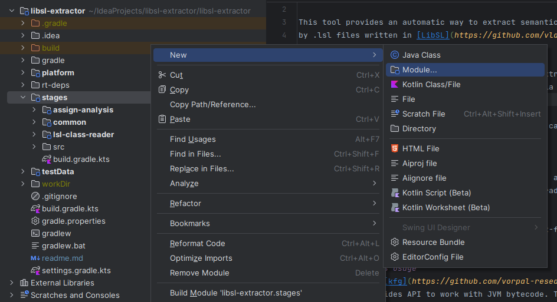

# LibSL descriptions extractor

This tool provides an automatic way to extract semantic information from JVM libraries. This information is represented
by .lsl files written in [LibSL](https://github.com/vldf/libsl) (library specification language).

## Implementing the new stage
Analyzing stages are atomic steps of specification extracting. To implement new one, you should:
1. Create new gradle submodule in module `stages` (via the IDE or manually)

2. Implement the interface `AnalysisStage`:
    ```kotlin
    class MyStage : AnalysisStage {
        override val name: String = "My Awesome Stage"
    
        override fun run(lslHolder: LslHolder) {
            // analysis logic
        }
    }
    ```
3. Add your analysis stage to the integration tests pipeline. You can do it in file
[TestPlatform](platform/src/test/kotlin/TestPlatform.kt), in property `analysisStagesFactory`.

## Tests
The testdata (files to be compiled and used in tests) are located [here](testData). You can add new packages like 
[existing ones](testData/src/main/java/me/vldf/lsl/test). Also, you can add any dependencies to gradle 
(see [build.gradle.kts](testData/build.gradle.kts)) and use it as a testdata.

After the new testdata was added, you should add test-function to [Tests.kt](platform/src/test/kotlin/Tests.kt). 
You can use this file for examples.

## Examples of APIs usage
The main APIs are [kfg](https://github.com/vorpal-research/kfg) and [LibSL Parser Api](https://github.com/vldf/libsl).
The first one provides API to work with JVM bytecode. The second one provides API to work with LibSL code: 
get info from it and update its structure. For examples and docs of LibSL parser visit its readme.

You can find an example of stage in `stages:lsl-class-reader` module. This module builds the framework of the processing 
library. This framework represents by LibSL parser's ASG. This module shows how to create new nodes such
as types, automata, functions, etc. 

Module `stages:assign-analysis` demonstrates how to use information from ASG: how to map entities from kfg to LibSL 
nodes, how to resolve functions and automata and other.
